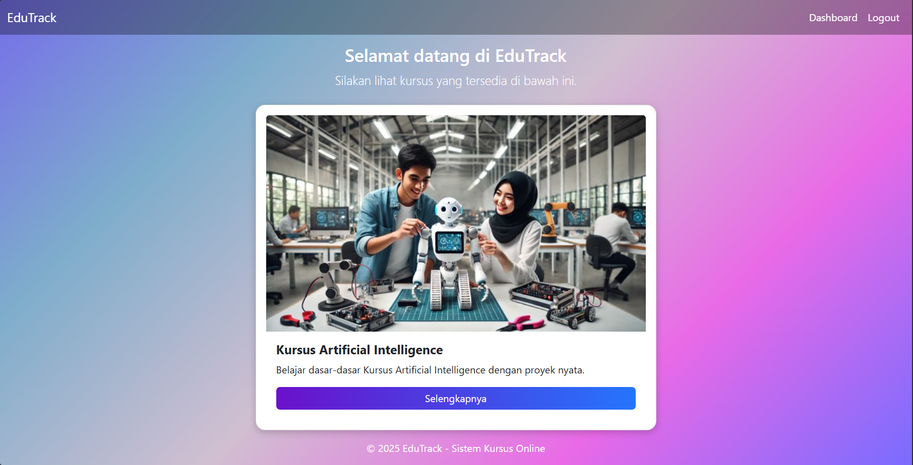

# edutrack

Edutrack ini merupaka sebuah aplikasi sistem pemesanan kursus online sederhana yang dibuat dengan menggunakan PHP dan MySQL. Tujuannya adalah untuk melihat kursus yang ada dan mendaftar kursus lalu membayarnya dengan aman dan terstruktur, dengan menerapkan stored procedure, trigger, transaction, dan stored function. Sistem ini juga dilengkapi dengan mekanisme backup otomatis untuk menjaga keamanan data pengguna jika terjadi sebuah kesalahan sistem.

# Detail Konsep

## Stored Procedure

Querry : 

## Trigger

Querry : 

## Transaction

## Stored Function
Querry:

Function TotalPaidByCourse untuk menghitung jumlah nominal uang yang telah dibayar untuk kursus tertentu. Berikut adalah cara untuk menampilkan Riwayat Pembayaran dengan menggunakan CALL Function:

## Backup Database
Backup database pada sistem web ini berfungsi untuk melindungi data transaksi agar tidak hilang akibat kerusakan sistem, kesalahan pengguna, atau serangan siber. Dengan backup, data penting seperti riwayat pembayaran, informasi pengguna, dan status transaksi dapat dipulihkan jika terjadi kegagalan sistem, sehingga menjaga keandalan layanan dan keamanan pengguna.
Querry:

Lalu dilakukan juga TASK SCHEDULER agar backup dapat dilakukan secara otomatis berdasarkan schedule yang sudah ditetapkan (Pada Projek ini Setiap Hari Pukul 00:00 WIB).
Kode:

Hasil backup Otomatis: 

## Relevansi dengan Pemrosesan Data Terdistribusi

